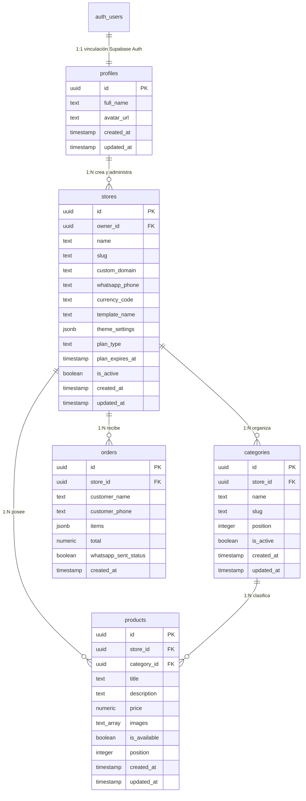

# Plan de Arquitectura Inicial - SaaS Multi-tenant de Comercio Ligero

Este documento presenta la propuesta de arquitectura inicial para el SaaS Multi-tenant de comercio electrónico ligero y catálogos digitales interactivos con envío de pedidos a WhatsApp.

## Stack Tecnológico Definido
El desarrollo se basará en las siguientes tecnologías principales:
*   **Framework de Frontend/Backend:** Next.js (App Router) alojado en **Vercel**.
*   **Lenguaje:** TypeScript (versión estable actual 5.x/superior).
*   **Base de Datos y Autenticación:** **Supabase** (PostgreSQL, Auth RLS).
*   **Estilos y UI:** **Tailwind CSS** y **Shadcn/ui**.
*   **Almacenamiento de Archivos (Maestro):** **Cloudflare R2** (buckets de almacenamiento compatibles con S3).
*   **Procesamiento y Entrega de Imágenes:** **Cloudinary** (transformación en tiempo real y CDN).
*   **Envío de Correos y Notificaciones:** **Resend** (para correos transaccionales de registro y alertas de la plataforma).
*   **Manejo de Formularios y Validación:** **React Hook Form** + **Zod**.
*   **Gestión del Estado del Carrito:** **Zustand** con persistencia en `LocalStorage`.

---

## Estructura de Carpetas Propuesta (Next.js App Router)

Para implementar un enrutamiento multi-inquilino robusto que admita tanto subdominios (`*.tuplataforma.com`) como dominios personalizados (`tienda.com`) sin duplicar código, utilizaremos una estructura basada en reescrituras dinámicas en el middleware, mapeando las peticiones a la ruta dinámica `/[domain]`.

```text
/
├── app/
│   ├── (marketing)/                # Dominio raíz (tuplataforma.com) - Landings públicas, registro
│   │   ├── page.tsx
│   │   └── layout.tsx
│   ├── (admin)/                    # Consola de administración (app.tuplataforma.com)
│   │   ├── dashboard/
│   │   │   └── page.tsx
│   │   ├── products/
│   │   │   └── page.tsx
│   │   ├── settings/
│   │   │   └── page.tsx
│   │   ├── layout.tsx
│   │   └── page.tsx
│   ├── [domain]/                   # Subdominios y dominios personalizados (ej. tienda.com)
│   │   ├── products/
│   │   │   └── [productId]/
│   │   │       └── page.tsx
│   │   ├── cart/
│   │   │   └── page.tsx
│   │   ├── layout.tsx              # Carga la plantilla visual elegida por el inquilino
│   │   └── page.tsx                # Catálogo público indexable del inquilino
│   ├── api/                        # APIs globales
│   │   └── webhooks/
│   ├── globals.css
│   ├── layout.tsx
│   └── providers.tsx
├── components/                     # Componentes compartidos y Shadcn/ui
│   ├── ui/                         # Componentes atómicos de Shadcn
│   └── templates/                  # Plantillas rígidas predefinidas para las tiendas
│       ├── minimal/
│       ├── bold/
│       └── playful/
├── lib/                            # Utilidades, clientes API, configuraciones
│   ├── supabase/
│   │   ├── client.ts               # Cliente del lado del navegador
│   │   ├── server.ts               # Cliente del lado del servidor (SSR)
│   │   └── middleware.ts           # Cliente para refrescar sesión en Middleware
│   └── utils.ts
├── middleware.ts                   # Orquestador del enrutamiento multi-tenant
├── supabase/                       # Configuraciones y migraciones locales de Supabase
│   ├── migrations/
│   └── config.toml
```

---

## Arquitectura de la Base de Datos (Supabase / PostgreSQL)

El diseño de la base de datos está estructurado bajo un modelo relacional multi-tenant de aislamiento lógico. Para la **Fase 1**, el esquema de base de datos constará de **5 tablas principales** que garantizan la integridad de los datos, el rendimiento en consultas concurrentes y la flexibilidad para futuras ampliaciones (como facturación o múltiples administradores).

### Diagrama Entidad-Relación (MER)



---

### Esquema Físico y Código SQL DDL

A continuación se detalla la definición estructurada de las tablas, restricciones de integridad, índices de rendimiento y automatizaciones (Triggers).

```sql
-- ----------------------------------------------------
-- CONFIGURACIÓN INICIAL Y EXTENSIONES
-- ----------------------------------------------------
create extension if not exists "uuid-ossp";

-- Función reutilizable para actualizar automáticamente la columna updated_at
create or replace function public.handle_updated_at()
returns trigger as $$
begin
    new.updated_at = timezone('utc'::text, now());
    return new;
end;
$$ language plpgsql;

-- ----------------------------------------------------
-- 1. TABLA: PROFILES
-- ----------------------------------------------------
create table public.profiles (
    id uuid references auth.users on delete cascade primary key,
    full_name text not null,
    avatar_url text,
    role text default 'user' not null,          -- Permite definir accesos ('user' o 'super_admin')
    created_at timestamp with time zone default timezone('utc'::text, now()) not null,
    updated_at timestamp with time zone default timezone('utc'::text, now()) not null,

    constraint profile_role_values check (role in ('user', 'super_admin'))
);

create trigger trigger_profiles_updated_at
    before update on public.profiles
    for each row execute function public.handle_updated_at();

-- ----------------------------------------------------
-- 1.5 TABLA GLOBAL: PLANS (Configuración central de la plataforma)
-- ----------------------------------------------------
create table public.plans (
    id text primary key,                        -- Identificador del plan: 'free', 'premium', 'enterprise'
    name text not null,
    price numeric(10, 2) not null check (price >= 0),
    currency text default 'USD' not null,
    billing_interval text default 'month' not null check (billing_interval in ('month', 'year')),
    max_products integer not null check (max_products >= 0),
    max_categories integer not null check (max_categories >= 0),
    custom_domain_allowed boolean default false not null,
    is_active boolean default true not null,
    created_at timestamp with time zone default timezone('utc'::text, now()) not null,
    updated_at timestamp with time zone default timezone('utc'::text, now()) not null
);

-- Triggers de auditoría para la tabla de planes
create trigger trigger_plans_updated_at
    before update on public.plans
    for each row execute function public.handle_updated_at();

-- Insertar configuración inicial de los planes de la plataforma central
insert into public.plans (id, name, price, currency, billing_interval, max_products, max_categories, custom_domain_allowed) values
('free', 'Plan Gratuito', 0.00, 'USD', 'month', 20, 5, false),
('premium', 'Plan Pro', 19.90, 'USD', 'month', 1000, 100, true);

-- ----------------------------------------------------
-- 2. TABLA: STORES
-- ----------------------------------------------------
create table public.stores (
    id uuid default gen_random_uuid() primary key,
    owner_id uuid references public.profiles(id) on delete cascade not null,
    name text not null,
    slug text not null unique,
    custom_domain text unique,
    whatsapp_phone text not null,
    currency_code text default 'USD' not null,
    template_name text default 'minimal' not null,
    theme_settings jsonb default '{}'::jsonb not null,
    plan_id text references public.plans(id) default 'free' not null, -- Clave externa a la tabla central de planes
    plan_expires_at timestamp with time zone,
    is_active boolean default true not null,
    created_at timestamp with time zone default timezone('utc'::text, now()) not null,
    updated_at timestamp with time zone default timezone('utc'::text, now()) not null,
    
    constraint store_slug_format check (slug ~* '^[a-z0-9-]+$'),
    constraint store_whatsapp_phone_format check (whatsapp_phone ~* '^\+[1-9]\d{1,14}$') -- E.164 formato
);

create index idx_stores_slug on public.stores(slug);
create index idx_stores_custom_domain on public.stores(custom_domain) where custom_domain is not null;

create trigger trigger_stores_updated_at
    before update on public.stores
    for each row execute function public.handle_updated_at();

-- ----------------------------------------------------
-- 3. TABLA: CATEGORIES
-- ----------------------------------------------------
create table public.categories (
    id uuid default gen_random_uuid() primary key,
    store_id uuid references public.stores(id) on delete cascade not null,
    name text not null,
    slug text not null,
    position integer default 0 not null,
    is_active boolean default true not null,
    created_at timestamp with time zone default timezone('utc'::text, now()) not null,
    updated_at timestamp with time zone default timezone('utc'::text, now()) not null,
    
    unique(store_id, slug)
);

create index idx_categories_store_id_position on public.categories(store_id, position);

create trigger trigger_categories_updated_at
    before update on public.categories
    for each row execute function public.handle_updated_at();

-- ----------------------------------------------------
-- 4. TABLA: PRODUCTS
-- ----------------------------------------------------
create table public.products (
    id uuid default gen_random_uuid() primary key,
    store_id uuid references public.stores(id) on delete cascade not null,
    category_id uuid references public.categories(id) on delete set null,
    title text not null,
    description text,
    price numeric(10, 2) not null check (price >= 0),
    images text[] default '{}'::text[] not null,
    is_available boolean default true not null,
    position integer default 0 not null,
    created_at timestamp with time zone default timezone('utc'::text, now()) not null,
    updated_at timestamp with time zone default timezone('utc'::text, now()) not null
);

create index idx_products_store_id_position on public.products(store_id, position);
create index idx_products_category_id on public.products(category_id) where category_id is not null;

create trigger trigger_products_updated_at
    before update on public.products
    for each row execute function public.handle_updated_at();

-- ----------------------------------------------------
-- 5. TABLA: PRODUCT_OPTIONS (Variantes, tallas, extras, ej. "Ingredientes Extra")
-- ----------------------------------------------------
create table public.product_options (
    id uuid default gen_random_uuid() primary key,
    product_id uuid references public.products(id) on delete cascade not null,
    name text not null,                         -- Ej. "Talla", "Tipo de Masa", "Ingrediente Extra"
    type text default 'radio' not null,         -- 'radio' (selección única), 'checkbox' (múltiple)
    is_required boolean default false not null,
    position integer default 0 not null,
    created_at timestamp with time zone default timezone('utc'::text, now()) not null,
    updated_at timestamp with time zone default timezone('utc'::text, now()) not null,

    constraint product_option_type_values check (type in ('radio', 'checkbox'))
);

create index idx_product_options_product_id on public.product_options(product_id);

create trigger trigger_product_options_updated_at
    before update on public.product_options
    for each row execute function public.handle_updated_at();

-- ----------------------------------------------------
-- 6. TABLA: PRODUCT_OPTION_VALUES (Valores de las opciones, ej. "Queso Extra +$1.50")
-- ----------------------------------------------------
create table public.product_option_values (
    id uuid default gen_random_uuid() primary key,
    option_id uuid references public.product_options(id) on delete cascade not null,
    value text not null,                         -- Ej. "Mediana", "Grande", "Queso Extra"
    price_modifier numeric(10, 2) default 0.00 not null, -- Costo adicional sumado al precio base
    position integer default 0 not null,
    created_at timestamp with time zone default timezone('utc'::text, now()) not null,
    updated_at timestamp with time zone default timezone('utc'::text, now()) not null
);

create index idx_option_values_option_id on public.product_option_values(option_id);

create trigger trigger_option_values_updated_at
    before update on public.product_option_values
    for each row execute function public.handle_updated_at();

-- ----------------------------------------------------
-- 7. TABLA: SHIPPING_RULES (Zonas y tarifas de envío)
-- ----------------------------------------------------
create table public.shipping_rules (
    id uuid default gen_random_uuid() primary key,
    store_id uuid references public.stores(id) on delete cascade not null,
    name text not null,                          -- Ej. "Envío Zona Norte", "Envío Gratis Metropolitana"
    min_order_amount numeric(10, 2) default 0.00 not null check (min_order_amount >= 0),
    price numeric(10, 2) default 0.00 not null check (price >= 0), -- Costo del envío
    is_active boolean default true not null,
    created_at timestamp with time zone default timezone('utc'::text, now()) not null,
    updated_at timestamp with time zone default timezone('utc'::text, now()) not null
);

create index idx_shipping_rules_store_id on public.shipping_rules(store_id);

create trigger trigger_shipping_rules_updated_at
    before update on public.shipping_rules
    for each row execute function public.handle_updated_at();

-- ----------------------------------------------------
-- 8. TABLA: ORDERS (Registro general de pedidos)
-- ----------------------------------------------------
create table public.orders (
    id uuid default gen_random_uuid() primary key,
    store_id uuid references public.stores(id) on delete cascade not null,
    customer_name text not null,
    customer_phone text not null,
    shipping_rule_id uuid references public.shipping_rules(id) on delete set null,
    shipping_price numeric(10, 2) default 0.00 not null check (shipping_price >= 0),
    subtotal numeric(10, 2) not null check (subtotal >= 0),
    total numeric(10, 2) not null check (total >= 0),
    whatsapp_sent_status boolean default false not null,
    status text default 'pending' not null,     -- 'pending' (creado), 'completed' (despachado), 'canceled' (cancelado)
    created_at timestamp with time zone default timezone('utc'::text, now()) not null,

    constraint order_status_values check (status in ('pending', 'completed', 'canceled'))
);

create index idx_orders_store_id_created on public.orders(store_id, created_at desc);

-- ----------------------------------------------------
-- 9. TABLA: ORDER_ITEMS (Productos individuales comprados en cada orden - Desacoplado)
-- ----------------------------------------------------
create table public.order_items (
    id uuid default gen_random_uuid() primary key,
    order_id uuid references public.orders(id) on delete cascade not null,
    product_id uuid references public.products(id) on delete set null,
    product_title text not null,                 -- Copia histórica por integridad si el producto se elimina
    price numeric(10, 2) not null check (price >= 0), -- Precio del producto en el momento exacto de la compra
    quantity integer not null check (quantity > 0),
    selected_options jsonb default '[]'::jsonb not null -- Opciones de variantes seleccionadas y su costo extra
);

create index idx_order_items_order_id on public.order_items(order_id);

-- ----------------------------------------------------
-- AUTOMATIZACIÓN DE AUTENTICACIÓN (Supabase Auth a Profiles)
-- ----------------------------------------------------
-- Función trigger para crear automáticamente el perfil público del vendedor
create or replace function public.handle_new_user()
returns trigger as $$
begin
    insert into public.profiles (id, full_name, avatar_url, role)
    values (
        new.id,
        coalesce(
            new.raw_user_meta_data->>'full_name',
            new.raw_user_meta_data->>'name',
            'Nuevo Vendedor'
        ),
        new.raw_user_meta_data->>'avatar_url',
        'user'
    );
    return new;
end;
$$ language plpgsql security definer;

-- Trigger asociado a la inserción en auth.users de Supabase
create trigger on_auth_user_created
    after insert on auth.users
    for each row execute function public.handle_new_user();

-- ----------------------------------------------------
-- POLÍTICAS DE SEGURIDAD (RLS) NATIVAS EN SUPABASE
-- ----------------------------------------------------

-- Habilitar RLS en todas las tablas
alter table public.profiles enable row level security;
alter table public.plans enable row level security;
alter table public.stores enable row level security;
alter table public.categories enable row level security;
alter table public.products enable row level security;
alter table public.product_options enable row level security;
alter table public.product_option_values enable row level security;
alter table public.shipping_rules enable row level security;
alter table public.orders enable row level security;
alter table public.order_items enable row level security;

-- Políticas para Profiles
create policy "Los usuarios pueden ver su propio perfil" on public.profiles
    for select using (auth.uid() = id);

create policy "Los usuarios pueden editar su propio perfil" on public.profiles
    for update using (auth.uid() = id);

-- Políticas para Plans (Configuración Global)
create policy "Cualquiera puede ver los planes activos" on public.plans
    for select using (is_active = true);

create policy "Solo los super admins pueden gestionar planes" on public.plans
    for all using (
        exists (
            select 1 from public.profiles 
            where profiles.id = auth.uid() and profiles.role = 'super_admin'
        )
    );

-- Políticas para Stores (Tiendas)
create policy "Cualquiera puede leer tiendas activas" on public.stores
    for select using (is_active = true);

create policy "Los dueños pueden gestionar su propia tienda" on public.stores
    for all using (auth.uid() = owner_id);

-- Políticas para Categories
create policy "Cualquiera puede ver categorias de tiendas activas" on public.categories
    for select using (
        exists (
            select 1 from public.stores 
            where stores.id = categories.store_id and stores.is_active = true
        )
    );

create policy "Los dueños pueden gestionar categorias de su tienda" on public.categories
    for all using (
        exists (
            select 1 from public.stores 
            where stores.id = categories.store_id and stores.owner_id = auth.uid()
        )
    );

-- Políticas para Products
create policy "Cualquiera puede ver productos de tiendas activas" on public.products
    for select using (
        exists (
            select 1 from public.stores 
            where stores.id = products.store_id and stores.is_active = true
        )
    );

create policy "Los dueños pueden gestionar productos de su tienda" on public.products
    for all using (
        exists (
            select 1 from public.stores 
            where stores.id = products.store_id and stores.owner_id = auth.uid()
        )
    );

-- Políticas para Product Options (Variantes)
create policy "Cualquiera puede ver opciones de productos activos" on public.product_options
    for select using (
        exists (
            select 1 from public.products
            join public.stores on stores.id = products.store_id
            where products.id = product_options.product_id and stores.is_active = true
        )
    );

create policy "Los dueños pueden gestionar opciones de productos" on public.product_options
    for all using (
        exists (
            select 1 from public.products
            join public.stores on stores.id = products.store_id
            where products.id = product_options.product_id and stores.owner_id = auth.uid()
        )
    );

-- Políticas para Product Option Values (Valores de Variantes)
create policy "Cualquiera puede ver valores de opciones de productos activos" on public.product_option_values
    for select using (
        exists (
            select 1 from public.product_options
            join public.products on products.id = product_options.product_id
            join public.stores on stores.id = products.store_id
            where product_options.id = product_option_values.option_id and stores.is_active = true
        )
    );

create policy "Los dueños pueden gestionar valores de opciones de productos" on public.product_option_values
    for all using (
        exists (
            select 1 from public.product_options
            join public.products on products.id = product_options.product_id
            join public.stores on stores.id = products.store_id
            where product_options.id = product_option_values.option_id and stores.owner_id = auth.uid()
        )
    );

-- Políticas para Shipping Rules
create policy "Cualquiera puede ver reglas de envio de tiendas activas" on public.shipping_rules
    for select using (
        exists (
            select 1 from public.stores 
            where stores.id = shipping_rules.store_id and stores.is_active = true
        )
    );

create policy "Los dueños pueden gestionar reglas de envio de su tienda" on public.shipping_rules
    for all using (
        exists (
            select 1 from public.stores 
            where stores.id = shipping_rules.store_id and stores.owner_id = auth.uid()
        )
    );

-- Políticas para Orders
create policy "Los compradores pueden crear pedidos" on public.orders
    for insert with check (true);

create policy "Los dueños pueden ver los pedidos de su tienda" on public.orders
    for select using (
        exists (
            select 1 from public.stores 
            where stores.id = orders.store_id and stores.owner_id = auth.uid()
        )
    );

-- Políticas para Order Items
create policy "Los compradores pueden registrar items de pedido" on public.order_items
    for insert with check (true);

create policy "Los dueños pueden ver items de pedidos de su tienda" on public.order_items
    for select using (
        exists (
            select 1 from public.orders
            join public.stores on stores.id = orders.store_id
            where orders.id = order_items.order_id and stores.owner_id = auth.uid()
        )
    );
```

---

## Flujo Lógico del Middleware

El middleware interceptará las solicitudes y determinará el enrutamiento interno apropiado basado en el host:

```mermaid
graph TD
    A[Inicio Petición HTTP] --> B[Obtener 'host' desde cabeceras y normalizar]
    B --> C{¿Es dominio principal o localhost?}
    C -- Sí --> D[Reescribir ruta a /app.tuplataforma.com o /(marketing)]
    C -- No --> E{¿Es subdominio de la plataforma?}
    E -- Sí [ej: tienda.tuplataforma.com] --> F[Extraer 'slug' del subdominio]
    E -- No [ej: tienda.com] --> G[Usar 'host' como custom_domain]
    F --> H[Reescribir dinámicamente a /app/[domain]/...]
    G --> H
    H --> I[Next.js resuelve el layout y renderiza página]
```

### Comportamiento del Middleware (Concepto)
1. **Detección de dominio**: Se examina el `x-forwarded-host` o `host`.
2. **Exclusiones**: Rutas estáticas como `_next`, `api`, `favicon.ico`, `assets` se omiten de la reescritura.
3. **Mapeo de Rutas**:
   - `[cualquier-otra-cosa]` -> `/[domain]` (Páginas del catálogo del inquilino, donde `[domain]` será el subdominio o el dominio personalizado completo).

---

## Decisiones de Arquitectura Consolidadas (Fase 1)

> [!NOTE]
> Basado en las sesiones de alineación técnica, se han tomado las siguientes decisiones de diseño e integración tecnológica para la Fase 1:

1. **Resolución de Inquilinos en Middleware (Edge):** Se realizarán consultas directas a Supabase inicialmente. La lógica se encapsulará en un helper de servicios (`lib/stores.ts`) para facilitar una migración transparente a Redis/Vercel KV en el futuro cuando el volumen lo requiera.
2. **Dominios Personalizados:** El middleware y la base de datos tendrán la columna `custom_domain` preparada estructuralmente. Sin embargo, en esta Fase 1, las tiendas operarán exclusivamente bajo subdominios de la plataforma (`slug.tuplataforma.com`).
3. **Persistencia del Carrito:** El estado del carrito de compras del cliente final se gestionará 100% en el lado del cliente utilizando `Zustand` con persistencia en `LocalStorage`. Solo el pedido consolidado final se enviará e insertará en la tabla `orders` de Supabase al confirmar la compra.
4. **Flujo de WhatsApp:** Se usará redirección directa mediante URLs dinámicas `https://wa.me/{telefono}?text={mensaje}` abiertas desde el navegador del cliente final. El mensaje contendrá los detalles estructurados y formateados del pedido en texto plano.
5. **Esquema de Plantillas Visuales:** Tendremos layouts rígidos predefinidos en `/components/templates/*` (ej. `minimal`, `playful`, `bold`). El vendedor podrá elegir un layout y una paleta de colores/tipografías predefinidas a través de un esquema JSON estricto (`theme_settings`).
6. **Manejo de Imágenes y Archivos (Cloudinary + Cloudflare R2):** Todas las fotos, videos y archivos se almacenarán de forma primaria en **Cloudflare R2** para minimizar los costes de almacenamiento y ancho de banda. La entrega y optimización dinámica de imágenes al comprador final se delegará a **Cloudinary** (aplicando transformaciones automáticas de tamaño y compresión, ej. `f_auto`, `q_auto`). El panel de administración utilizará subidas directas firmadas (Client-Side Upload with Presigned Signatures) para mejorar la velocidad y no sobrecargar el servidor de Next.js.
7. **Formularios y Validación:** Se utilizará **React Hook Form** junto con **Zod** para la definición y validación de todos los formularios de la plataforma (ej. creación de productos, ajustes de tienda). Los esquemas de validación Zod se compartirán entre el cliente y el backend (Server Actions/APIs).
8. **Moneda y Localización:** Se soportará multi-moneda a nivel de tienda mediante un campo `currency_code` (ISO 4217) configurable en los ajustes de la tienda. El renderizado y formateo de precios en los catálogos dinámicos se realizará en el cliente usando la API nativa de JavaScript `Intl.NumberFormat`.
9. **Modelo de Suscripción (Monetización):** El lanzamiento inicial será 100% gratuito para captar usuarios. No obstante, las bases de datos contarán con las columnas `plan_type` y `plan_expires_at` estructuradas en la tabla `stores` para facilitar la migración automática a un esquema Free/Premium en el futuro.
10. **Envío de Correos y Notificaciones (Resend):** Se utilizará **Resend** como proveedor de correos electrónicos transaccionales para gestionar el flujo de registro, confirmaciones de cuentas de vendedores y alertas críticas del sistema.
11. **Estrategia de Autenticación (Supabase Auth - Email & Google):** El registro y acceso de los vendedores a su consola administrativa se gestionará de manera segura usando **Supabase Auth**. Se habilitará el inicio de sesión con **Correo Electrónico (Email)** clásico (con opción de verificación de cuenta) y el login social **Google OAuth**. Los flujos de redirección tras el inicio de sesión se configurarán dinámicamente utilizando el parámetro `redirectTo` para redirigir al vendedor de vuelta a `app.tuplataforma.com/dashboard` (o su homólogo local en desarrollo).

---

## Especificaciones del Panel de Administración (Vendedor)

El panel del vendedor (`app.tuplataforma.com`) estará estructurado en **5 secciones funcionales**, diseñadas para gestionar todo el ciclo operativo de la tienda utilizando el esquema de base de datos normalizado:

### 1. Dashboard (Métricas y Estado)
*   **Métricas en Tiempo Real:** Tarjetas con el acumulado mensual de ventas (suma de `total` en `orders` con estado `completed`), número de pedidos totales y conversión de carritos.
*   **Pedidos Urgentes:** Un listado visual de las últimas órdenes con estado `pending` para despacho inmediato.
*   **Estado del Plan:** Indicador dinámico del plan contratado (`plan_id` de la tabla `plans`), vigencia y consumo de recursos (ej: "15 de 20 productos creados").

### 2. Pedidos y Logística (Gestión de Ventas)
*   **Bandeja de Pedidos:** Tabla filtrable por estado (`pending`, `completed`, `canceled`) y buscador por nombre/teléfono del cliente.
*   **Detalle de Orden:** Modal que muestra:
    *   Información del cliente (Nombre, Teléfono).
    *   Productos e items de compra (desde la tabla relacional `order_items`) con cantidad y opciones de variantes elegidas.
    *   Desglose económico: Subtotal, costo de envío y total.
*   **Acciones Operativas:**
    *   Botón *"Abrir chat en WhatsApp"*: Abre directamente el chat con el comprador final para coordinar entrega.
    *   Botón *"Marcar como Despachado"* o *"Marcar como Cancelado"*, que actualiza la columna `status` en la tabla `orders` para métricas internas.

### 3. Catálogo (Productos y Variantes)
*   **Gestor de Categorías:** Interfaz para crear, editar o borrar categorías de la tabla `categories`, con ordenamiento por arrastre (drag-and-drop para redefinir el campo `position`).
*   **Gestor de Productos (Inventario):**
    *   Formulario de creación y edición (con validación de esquemas Zod).
    *   Cargador de imágenes con arrastre (subida directa firmada a Cloudinary con guardado en R2).
    *   **Editor de Variantes:** Opción para añadir variantes al producto (ej: Talla, Sabor, Ingrediente extra), insertando filas correspondientes en las tablas `product_options` y `product_option_values` con sus respectivos modificadores de costo.
    *   Interruptor rápido de disponibilidad para alternar el campo `is_available` en caliente.

### 4. Métodos de Envío (Logística de Entrega)
*   **Reglas de Despacho:** Formulario para agregar y editar reglas de envío (`shipping_rules`).
*   **Configuración:** Permite al vendedor definir:
    *   Nombre de la zona de cobertura (ej. "Envío express casco urbano").
    *   Costo de entrega (ej. $3.00 USD).
    *   Monto mínimo para aplicar envío gratis (ej. Gratis en compras mayores a $50.00 USD).

### 5. Ajustes y Personalización de Tienda
*   **Datos de Contacto:** Modificación de WhatsApp receptor (`whatsapp_phone`), slug URL (subdominio) y datos de marca.
*   **Diseño Estético:** 
    *   Selector de plantilla activa (`template_name` de `stores`).
    *   Paleta de colores (color primario, secundario, de fondo) y fuentes tipográficas validadas en el JSON `theme_settings`, que alimentan las variables CSS del catálogo final.

---

## Bases de Operación y Configuración del Entorno

### 1. Variables de Entorno Requeridas (.env.example)
```bash
# Supabase (Configuración Core y RLS)
NEXT_PUBLIC_SUPABASE_URL=your_supabase_url
NEXT_PUBLIC_SUPABASE_ANON_KEY=your_supabase_anon_key
SUPABASE_SERVICE_ROLE_KEY=your_supabase_service_role_key

# Cloudflare R2 (Almacenamiento Maestro - Servidor)
CLOUDFLARE_R2_ACCESS_KEY_ID=your_r2_access_key
CLOUDFLARE_R2_SECRET_ACCESS_KEY=your_r2_secret_key
CLOUDFLARE_R2_BUCKET_NAME=your_r2_bucket_name
CLOUDFLARE_R2_ENDPOINT=https://your_account_id.r2.cloudflarestorage.com

# Cloudinary (Entrega y Transformación - Cliente/Servidor)
NEXT_PUBLIC_CLOUDINARY_CLOUD_NAME=your_cloudinary_cloud_name
CLOUDINARY_API_KEY=your_cloudinary_key
CLOUDINARY_API_SECRET=your_cloudinary_secret

# Resend (Correos Transaccionales)
RESEND_API_KEY=re_your_resend_api_key

# Dominio Base de la Plataforma (para el Middleware)
NEXT_PUBLIC_ROOT_DOMAIN=tuplataforma.com
```

### 2. Seguridad en Onboarding, Proveedores de Autenticación y Conflictos de Ruta
El registro y creación de cuentas de nuevos vendedores se gestionará mediante **Supabase Auth** de la siguiente manera:

*   **Proveedores de Identidad (Auth Providers):**
    *   **Email y Contraseña:** Registro estándar donde el vendedor ingresa sus credenciales y el sistema envía un correo de confirmación de cuenta a través del conector de **Resend**.
    *   **Google OAuth:** Botón de registro rápido "Iniciar sesión con Google". Supabase Auth redirigirá al vendedor al flujo oficial de Google OAuth.
*   **Triggers de Sincronización Automática:** Cuando un usuario se registra con éxito (vía Email o Google), el trigger de PostgreSQL `on_auth_user_created` inyectará inmediatamente sus datos (ID, nombre completo y foto de perfil provenientes de la cuenta de Google) en la tabla `public.profiles`.
*   **Configuración de Redirecciones Permitidas (Redirect URLs):** En el panel web de Supabase Auth, se deben dar de alta las siguientes direcciones de retorno para procesar los tokens de sesión de forma segura:
    *   *Local (Desarrollo):* `http://localhost:3000/auth/callback`
    *   *Producción:* `https://app.tuplataforma.com/auth/callback`
*   **Seguridad de Rutas (Slugs Reservados):** Para evitar colisiones de rutas del sistema con los subdominios de inquilinos en el middleware, implementaremos una lista estricta de **Slugs Reservados** en el flujo de registro/creación de tienda.
    *   *Lista de palabras reservadas:* `app`, `www`, `api`, `admin`, `assets`, `static`, `support`, `sitemap`, `robots`, `help`, `billing`, `legal`, `terms`, `privacy`, `dev`.
    *   *Restricción por base de datos:* El trigger de validación de base de datos y la validación de esquemas Zod en el frontend rechazarán slugs que coincidan con esta lista.

### 3. Estrategia de Renderizado CSS para Plantillas Rígidas (Evitar Cumulative Layout Shift)
Para aplicar de forma segura las configuraciones visuales del vendedor (`theme_settings` con colores primarios, secundarios, etc.) sin sufrir parpadeos (Flash of Unstyled Content / FOUC) en el cliente final:
*   El layout raíz de `app/[domain]/layout.tsx` (que se ejecuta en el servidor) consultará los datos de la tienda.
*   Inyectará las variables de color CSS directamente en las propiedades `style` del tag `<html>` o `<body>` como variables CSS inline:
    ```tsx
    const themeStyles = {
      '--color-primary': store.theme_settings.primary_color || '#3b82f6',
      '--color-secondary': store.theme_settings.secondary_color || '#1e293b',
      '--font-family': store.theme_settings.font_family || 'Inter',
    } as React.CSSProperties;
    
    return <html style={themeStyles} className={themeStyles['--font-family']}>...</html>
    ```
*   Los componentes visuales del catálogo en `/components/templates/*` consumirán estas clases semánticas de Tailwind (ej: `bg-[var(--color-primary)]` o `text-[var(--color-secondary)]`) garantizando una experiencia instantánea y uniforme.

### 4. Preparación para el Modelo Freemium/Premium (Monetización Futura)
Para asegurar que podamos activar suscripciones de pago y limitar funcionalidades en el futuro sin tener que reestructurar el backend, se implementará la siguiente lógica desacoplada desde el día uno:
*   **Campos de Control en BD:** La tabla `stores` ya incluye los campos `plan_type` y `plan_expires_at`.
*   **Abstracción de Límites en Código (Configuración):** Definiremos un archivo de constantes de planes en `lib/plans.ts`:
    ```typescript
    export const PLAN_LIMITS = {
      free: {
        maxProducts: 20,
        maxCategories: 5,
        allowedTemplates: ['minimal'],
        customDomainAllowed: false,
      },
      premium: {
        maxProducts: 1000,
        maxCategories: 100,
        allowedTemplates: ['minimal', 'playful', 'bold'],
        customDomainAllowed: true,
      }
    };
    ```
*   **Validaciones en API / Server Actions:** Al guardar un producto o categoría, el backend verificará el `plan_type` de la tienda contra los límites definidos. Si supera el límite, la acción del servidor retornará un error estructurado bloqueando la inserción.
*   **Escalabilidad a Pasarela de Pagos (Stripe):** Cuando se decida monetizar, únicamente crearemos un endpoint webhook de Stripe que escuche eventos de pago (`invoice.paid`, `customer.subscription.deleted`). Este webhook actualizará las columnas `plan_type` y `plan_expires_at` en la tabla `stores` de Supabase basándose en el ID de cliente de Stripe. Todo el resto de la plataforma responderá automáticamente a este cambio de estado sin modificaciones en el núcleo de la aplicación.

---

## Optimización para Navegadores Integrados (In-App Browsers de Instagram, TikTok, Facebook)

> [!IMPORTANT]
> Un gran porcentaje del tráfico de compras provendrá de enlaces que los vendedores publiquen en sus biografías o videos de TikTok, Instagram y Facebook. Los navegadores integrados de estas aplicaciones tienen restricciones severas de cookies, almacenamiento local y rendimiento. Hemos diseñado las siguientes soluciones de mitigación:

### 1. Robustez del Carrito de Compras (Híbrido Cookie/LocalStorage)
*   **El Problema:** Los navegadores de Instagram y TikTok a veces borran el `LocalStorage` al cerrar el WebView o no lo comparten entre sesiones de la app, haciendo que el carrito del cliente se borre de forma imprevista.
*   **La Solución:** Implementaremos una persistencia híbrida. Zustand guardará el carrito en `LocalStorage`, pero además sincronizaremos el carrito con una **Cookie de sesión segura y de larga duración**. Las cookies tienen una persistencia superior en los entornos de WebViews embebidos de iOS y Android. Si el `LocalStorage` es purgado, la aplicación se hidratará automáticamente leyendo la cookie de respaldo, recuperando el carrito del usuario.

### 2. Evitar Bloqueos de Redirección profunda a WhatsApp (Deep Linking)
*   **El Problema:** Muchos navegadores integrados (especialmente en Android) bloquean los enlaces acortados tradicionales tipo `https://wa.me/...` o disparan advertencias de seguridad al intentar abrir aplicaciones externas.
*   **La Solución:** En lugar de usar `wa.me`, la redirección al presionar "Finalizar Pedido" se construirá utilizando la URL universal de API de WhatsApp:
    `https://api.whatsapp.com/send?phone={telefono}&text={mensaje}`
    Este formato oficial de subdominio cuenta con certificados SSL validados globales que los navegadores integrados de Meta e ByteDance reconocen como seguros, lo que fuerza la apertura inmediata y nativa de la aplicación de WhatsApp instalada en el dispositivo móvil del comprador sin advertencias ni pantallas en blanco.

### 3. Velocidad de Carga Extrema (LCP < 1.2s) para Evitar el Abandono
*   **El Problema:** La tasa de rebote en WebViews de redes sociales se duplica por cada segundo de retardo. Si el catálogo tarda más de 2 segundos en cargar, el usuario cierra la pestaña y vuelve al feed de la app.
*   **La Solución:**
    *   **Pre-renderizado en Servidor (SSR/ISR):** El catálogo de productos (`/[domain]/page.tsx`) se generará en el servidor, devolviendo un HTML estático optimizado de forma inmediata. No habrá pantallas de carga ni spinners largos.
    *   **Imágenes Optimizadas (Cloudinary):** Todas las fotos de productos se entregarán mediante Cloudinary utilizando el componente `next/image` de Next.js. Cloudinary convertirá dinámicamente las imágenes a formatos de última generación como **AVIF o WebP** y reducirá la resolución de forma responsiva según el tamaño de la pantalla del celular (ej. usando la transformación `w_auto,c_scale` y `q_auto,f_auto`).
    *   **Fonts Locales sin Bloqueo:** Las fuentes de Google Fonts (ej. Inter) se servirán localmente auto-hospedadas a través de `@next/font`, previniendo que el renderizado de texto del catálogo se bloquee esperando que cargue un servidor de fuentes externo.

---

## Seguridad, Mitigación de Riesgos y Prevención de Vulnerabilidades

> [!WARNING]
> En un entorno SaaS multi-tenant expuesto al público, la seguridad es un pilar crítico. Hemos diseñado la plataforma previniendo proactivamente los siguientes vectores de ataque y "huecos" comunes:

### 1. Fugas de Datos entre Inquilinos (Tenant Data Leakage)
*   **El Riesgo:** Que un vendedor autenticado pueda inyectar comandos o peticiones para alterar productos o leer pedidos de otra tienda.
*   **La Mitigación:** Habilitación estricta de **Supabase RLS (Row Level Security)** en cada tabla. En el código de Next.js, se utilizará siempre el cliente de Supabase instanciado con la sesión del usuario (`supabase/server.ts` o `supabase/client.ts`). Queda **estrictamente prohibido** utilizar la clave `service_role` (que se salta RLS) en los Server Actions o API Routes del panel de administración del vendedor. El rol de servicio se limitará exclusivamente al middleware para la resolución inicial del dominio/subdominio, donde las lecturas son de solo lectura y solo para campos públicos de configuración.

### 2. Inyección SQL y XSS (Cross-Site Scripting) en Slugs y Campos de Entrada
*   **El Riesgo:** Un vendedor malicioso podría configurar un slug de tienda con caracteres especiales o inyectar código Javascript en la descripción de un producto, ejecutándolo en el navegador de los compradores finales.
*   **La Mitigación:** 
    *   **Restricciones regex a nivel de Base de Datos:** Los slugs de las tiendas y categorías tienen restricciones `check` rígidas que impiden el uso de caracteres especiales (`slug ~* '^[a-z0-9-]+$'`).
    *   **Sanitización con Zod:** Los esquemas de validación Zod en el backend filtrarán y escaparán cadenas antes de insertarlas en Supabase.
    *   **React escaping:** Next.js escapa de forma nativa los strings renderizados en JSX para evitar ataques XSS estándar. Si se requiere renderizar texto enriquecido en descripciones de producto, se usará una librería de sanitización del DOM (como `isomorphic-dompurify`).

### 3. Ataques de Spam de Pedidos (Checkout abuse)
*   **El Riesgo:** La inserción en la tabla `orders` es pública para permitir que cualquier comprador final registre una orden. Un bot atacante podría realizar peticiones POST masivas a Supabase, saturando la base de datos de registros falsos (Spam/DDoS).
*   **La Mitigación:**
    *   **Rate Limiting:** Implementaremos límites de tasa (rate limiting) en las API Routes / Server Actions de finalización de compra usando Vercel Edge Rate Limiting o middleware de limitación basado en la dirección IP.
    *   **Capcha/Turnstile invisible:** Soportar en las bases del frontend la integración de Cloudflare Turnstile o Google ReCaptcha v3 en el botón de finalizar compra para validar la humanidad del cliente antes de insertar el pedido en Supabase y redirigir a WhatsApp.

### 4. Agotamiento de Recursos en el Middleware (DDoS al pool de conexiones)
*   **El Riesgo:** Cada petición HTTP a cualquier catálogo ejecutará el middleware, el cual hace una lectura a Supabase. Bajo tráfico pesado o ataques DDoS directos, esto podría agotar instantáneamente el pool de conexiones de la base de datos de Supabase.
*   **La Mitigación:**
    *   **Supabase Connection Pooling (Supavisor):** El Middleware se conectará a Supabase utilizando el puerto de Pooling (modo transaccional) en lugar de la conexión directa a Postgres.
    *   **Estrategia de Caché Local del Middleware:** El middleware implementará un sistema de caché de memoria en memoria por tiempo de expiración corto (ej: LRU cache de 1 minuto) para el mapeo de subdominios activos, reduciendo drásticamente las consultas redundantes a Supabase en ráfagas de tráfico.

---

## Plan de Verificación Inicial

### Fase de Desarrollo y Pruebas Locales
- **Simulación de Subdominios:** Utilizar dominios locales configurados en el archivo `hosts` del sistema operativo (ej. `tienda1.localhost:3000`, `tienda2.localhost:3000`) para validar que el middleware Next.js reescriba correctamente hacia `/[domain]`.
- **Validación RLS (Seguridad):** Pruebas de integración intentando leer/escribir productos o configuraciones de la tienda `Store A` utilizando una sesión autenticada correspondiente a la cuenta dueña de la tienda `Store B`. Deben fallar de forma nativa con error de Supabase.
- **Validación del Flujo de Carrito a WhatsApp:** Comprobar que al pulsar "Finalizar Pedido" se cree correctamente el registro en `orders` con estado inicial y se genere la URL de redirección a WhatsApp con el texto correcto codificado en URI.

---

## Guía de Ejecución para el Agente (Antigravity IDE Instructions)

> [!NOTE]
> Esta sección sirve de manual operativo para que cualquier instancia de Antigravity IDE (o subagente) ejecute este plan de manera autónoma, robusta y alineada.

### 1. Inicialización y Preparación del Entorno
1.  **Directorio de Trabajo:** El agente debe sugerir y crear la carpeta del proyecto en `C:\Users\1964-oti\.gemini\antigravity-ide\scratch\saas-multitenant`. Recomendar inmediatamente al usuario que configure ese directorio como su espacio de trabajo activo.
2.  **Inicialización de Next.js:** Proponer y ejecutar en la consola de comandos de Windows (Powershell) la creación de Next.js en el directorio actual en modo no interactivo y con TypeScript, Tailwind y ESLint:
    `npx -y create-next-app@latest ./ --typescript --tailwind --eslint --app --src-dir false --use-npm`
3.  **Configuración de Shadcn/UI:** Ejecutar la inicialización de Shadcn de forma automatizada:
    `npx -y shadcn@latest init -d`

### 2. Gestión de Credenciales y Variables de Entorno
*   El agente **NUNCA** debe inventar credenciales reales.
*   El agente debe crear el archivo `.env.local` basándose en el formato de `.env.example` definido arriba.
*   Debe preguntar al usuario de forma clara que provea las credenciales reales de Supabase, Cloudflare R2, Cloudinary y Resend a través del chat antes de intentar conectar cualquier cliente de backend o probar las peticiones.

### 3. Configuración de Base de Datos y Supabase local
*   Si se detecta el Supabase CLI y Docker en el sistema, inicializar el entorno local:
    `npx supabase init`
*   Escribir las migraciones SQL proporcionadas en este plan dentro de un nuevo archivo en `supabase/migrations/<timestamp>_init_schema.sql`.
*   Si el usuario prefiere Supabase Cloud (en la nube), guiarlo para que pegue el script DDL de este plan en el **SQL Editor** del panel de control de Supabase.

### 4. Flujo de Codificación Secuencial
Para minimizar errores, el agente debe proceder en el siguiente orden de dependencias:
1.  **BD y Conectores:** Escribir los tipos de TypeScript generados por Supabase y la inicialización de los clientes Supabase (Server, Client, Middleware) en `/lib/supabase/`.
2.  **Helpers del Core:** Escribir la lógica de validación de inquilinos y dominios en `/lib/stores.ts`.
3.  **Middleware:** Escribir `middleware.ts` en la raíz del proyecto para orquestar el enrutamiento.
4.  **Consola del Vendedor (Admin):** Desarrollar la autenticación de Supabase, la creación de productos/categorías, y los ajustes de tienda en `/app/(admin)`.
5.  **Catálogos Públicos (Comprador):** Implementar la carga dinámica de plantillas en `/app/[domain]/layout.tsx`, el renderizado de la tienda en `/app/[domain]/page.tsx`, y el carrito local en `/app/[domain]/cart/page.tsx` usando Zustand.
6.  **Integración de WhatsApp:** Crear la lógica de formateo del mensaje del pedido y la redirección en el frontend.
7.  **Servicios Externos:** Escribir el gestor de subida de imágenes a Cloudinary/R2 y el gestor de correo con Resend.

